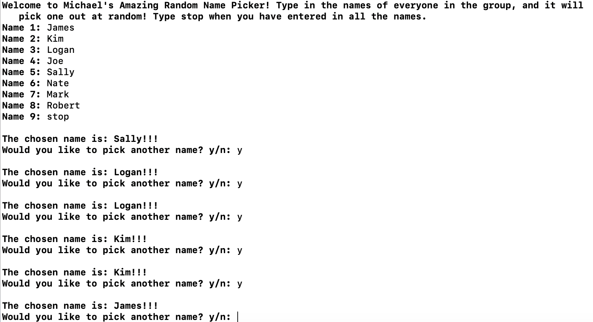

#  Objective-C Class Test

## Overview
This program allows you to type in people's names (or anything else) and it will pick one out at random. I made this to learn how to use NSStrings and  NSArrays. 

## Development Envirnment
I created this using Xcode version 12.1. To set up this project, first install Xcode if you don't have it already. Then go to Source Control->Clone and then paste in the link to this Github repository. The project should download and be setup automatically. Press the build and run button to test the code. 

 

## Useful Websites
[Techotopia](https://www.techotopia.com/index.php/Objective-C_Inheritance)

[C for Dummies](https://www.dummies.com/programming/c/how-to-generate-random-numbers-in-c-programming/)

[Journal Dev](https://www.journaldev.com/10182/nsarray-nsmutablearray-objective-c-array)

[Tutorialspoint](https://www.tutorialspoint.com/objective_c/index.htm)

[Apple's Ojective-C Book](https://developer.apple.com/library/archive/documentation/Cocoa/Conceptual/ProgrammingWithObjectiveC/Introduction/Introduction.html)

[Python Reference](https://docs.python.org/3/tutorial/index.html)
